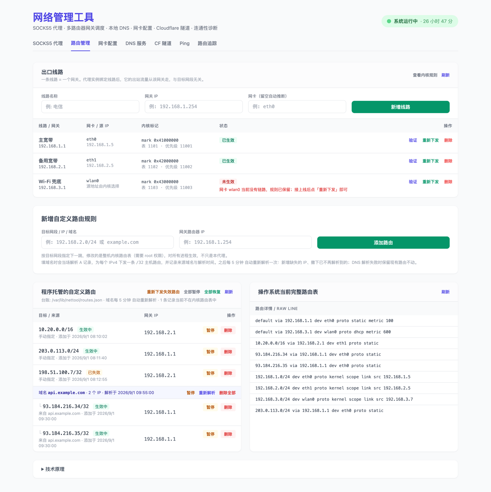
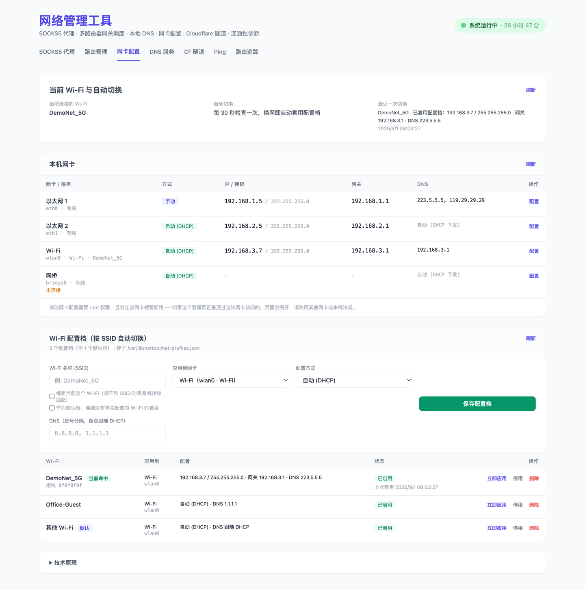
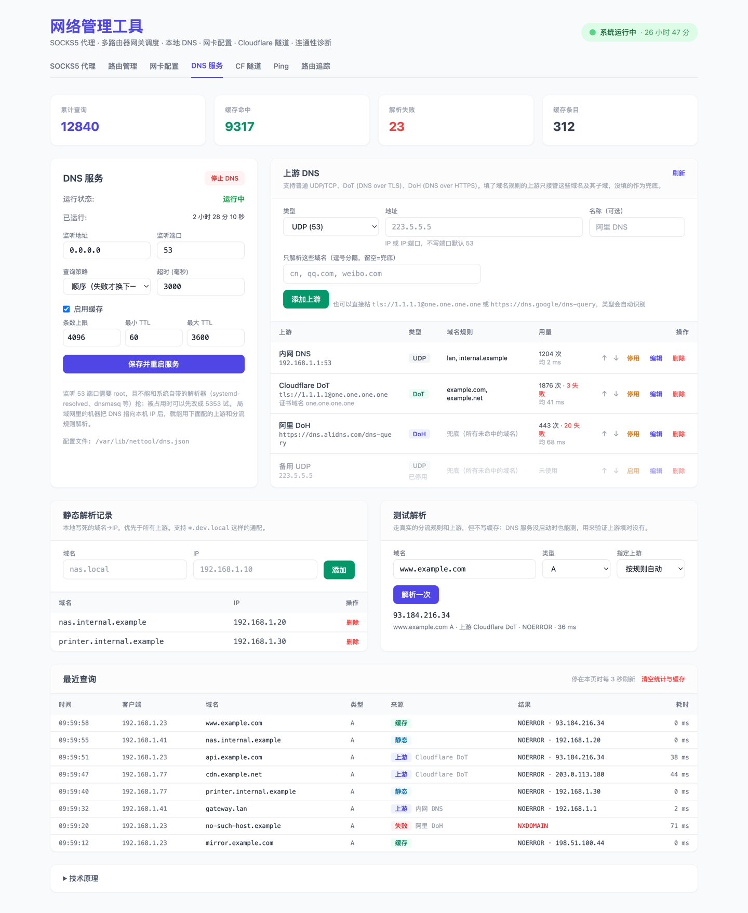
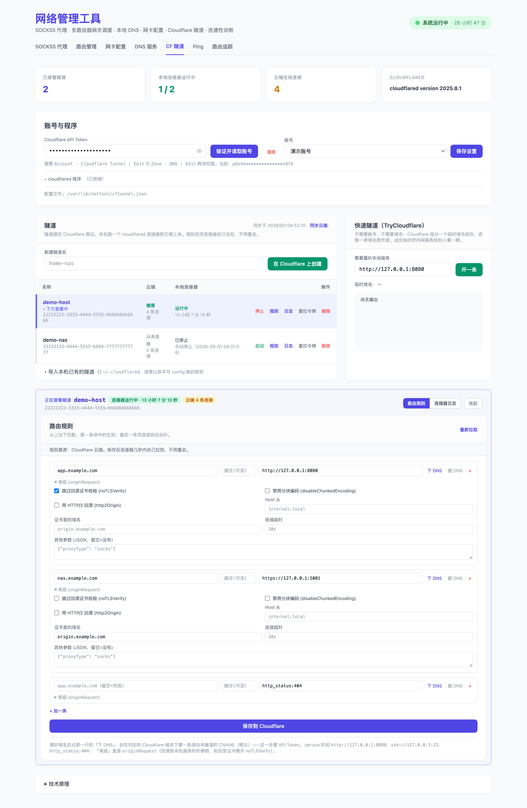
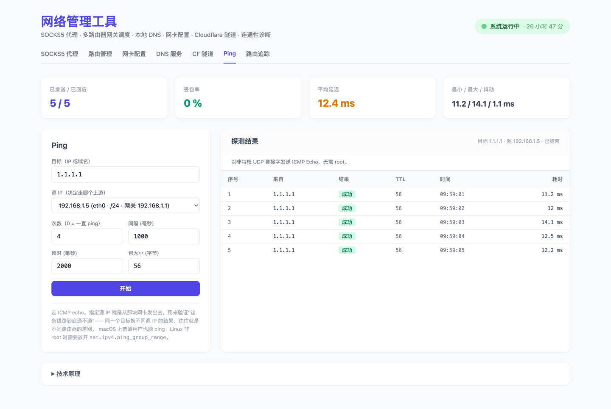
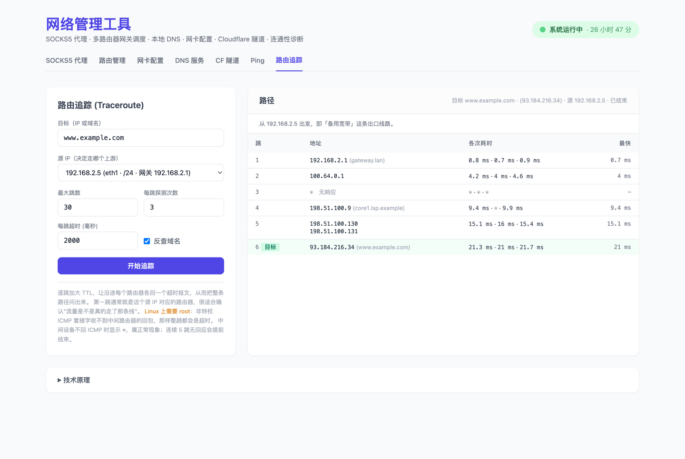

# nettool（网络管理工具）

一台机器同时接了多个路由器 / 多条宽带时，用它把「哪些流量走哪条线」管起来，并顺手把 DNS、网卡配置和连通性排查一起做了。
Go 编写，单个二进制、无外部运行依赖，所有操作都在内嵌的 Web 后台完成，也都有对应的 RESTful 接口。

---

## 功能一览

| 页签 | 干什么 | 主要接口 |
| --- | --- | --- |
| **SOCKS5 代理** | **多个** SOCKS5 实例，各自监听不同端口、绑定不同的**出口线路**（即各走各的网关，由路由决定而非绑源 IP），实时看连接与流量 | `/api/proxy/instances`、`/api/status`、`/api/proxy`、`/api/stats`、`/api/egress-ip`、`/api/interfaces` |
| **路由管理** | 上半部分是**出口线路**（决定某个代理实例走哪个网关：Linux 策略路由 / macOS PF route-to）；下半部分按网段或域名下发系统路由指向某个网关，带台账、启动对账、定时重解析、暂停/恢复 | `/api/uplinks*`、`/api/capabilities`、`/api/routes*`、`/api/system-routes` |
| **网卡配置** | 改本机网卡的 IP / 掩码 / 网关 / DNS，并按连上的 Wi-Fi 自动套用配置档 | `/api/net/*` |
| **DNS 服务** | 本机 DNS 解析器：UDP/TCP/DoT/DoH 上游、按域名分流、缓存、静态记录 | `/api/dns*` |
| **CF 隧道** | Cloudflare Tunnel：调 API 在云端建/删隧道、改 ingress 规则、下 DNS 记录，本机托管 cloudflared 连接器；已经在用 `tunnel create` + config.yml 的可以一键导入接着用；另有不需要账号的临时隧道 | `/api/cftunnel*` |
| **Ping** | ICMP 连通性测试，可指定源 IP —— 同一个目标换条线路试，结果一目了然 | `/api/diag/ping` |
| **路由追踪** | traceroute，逐跳看流量实际经过哪些路由器，同样可指定源 IP | `/api/diag/traceroute` |

所选页签记忆在 localStorage 中，刷新后回到上次那页。


> 本文所有截图里的 IP、域名、SSID、隧道 ID 与账号名都是演示数据（`example.com`、`192.168.x.x`、`203.0.113.x` 等文档保留地址），不对应任何真实网络。

贯穿全局的几件事：

- **Web 后台登录认证**：`-user` / `-pass`（或 `NETTOOL_USER` / `NETTOOL_PASS`）开启 HTTP Basic Auth，保护控制台与全部 API；两个都留空则不鉴权——所以后台默认只听 `127.0.0.1`。
- **按上次的状态启动**：SOCKS5 代理、DNS 服务与各条 Cloudflare 隧道的开关状态跟着配置一起存盘，进程重启（升级、崩溃、机器重启）后照着上次退出前的样子恢复——上次开着就自动起来，上次点过「停止」就保持停止，不用每次再去后台点一次。全新安装（还没有配置文件）时都不启动，避免装好就抢端口；`-start-proxy` / `-start-dns` / `-start-cftunnel` 则是无条件启动，不看上次状态。
- **配置各自独立成 JSON**：路由台账、出口线路台账、Wi-Fi 配置档、DNS 配置、代理配置、隧道配置六份文件互不干扰，一律先写临时文件再原子替换，掉电不会留下半个文件。其中 `cftunnel.json` 里有机密（Cloudflare API Token 与各隧道的连接器令牌），权限是 `0600` 而不是 `0644`。
- **系统服务模板**：`deploy/` 下有 Linux systemd、OpenWrt procd 与 Windows 计划任务三份配置，开机自启 + 崩溃自动重启。
- **不认本地化文案**：Windows 的 `netsh` / `route` 输出跟着系统语言走（中文版打印的是「接口 xxx 的配置」「在链路上」），所以那边的读取一律走 PowerShell 的 `Get-Net*`（属性名与枚举值固定）或只认数据行的形状，中文系统上一样能用。

---

## 一、SOCKS5 代理

### 多实例

一个实例 = 一个监听端口 + 一条出口线路。要「8091 走电信、8092 走联通、8093 走第三个网关」，就建三个实例、各绑一条[出口线路](#二出口线路按实例选网关)。

- 实例之间除了共用一份配置文件，运行时完全隔离：各有各的监听口、拨号器、DNS 解析器和流量统计。
- 顶部四张统计卡是**全部实例的合计**；选中某个实例后，下面的配置卡与连接列表只针对它。
- 端口撞车会直接说「端口 8091 已被实例「默认代理」占用」，而不是丢一句 `bind: address already in use`。
- 接口：`GET/POST /api/proxy/instances`（列表 / 新建）、`DELETE /api/proxy/instances?id=pN`。改配置仍走 `POST /api/status`，带上 `id` 即可。

> **从旧版本升级**：旧的 `proxy.json` 是单个扁平对象（v1），首次启动会自动迁移成 v2 的实例列表，端口 / 代理 DNS / 开关状态一个都不会丢，`outbound_ip` 会转成一条出口线路（见下），原文件备份为 `proxy.json.v1.bak`。`/api/status`、`/api/proxy`、`/api/stats`、`/api/egress-ip` 这几个老接口全部保留，不带 `id` 时作用于第一个实例，原有脚本不用改。

### 启停与状态

- 程序启动后各实例按**自己上次退出前的开关状态**恢复：上次是开着的就自动开始监听，上次点过「停止代理」就只加载配置、不监听。第一次运行（还没有 `proxy.json`）时不启动，在 Web 后台点「启动代理」即可，之后这个选择就会被记住。想无条件开机即启加 `-start-proxy`（作用于全部实例）。
- 实例名、端口、出口线路、代理 DNS 都存在 `proxy.json` 里（默认与路由台账同目录，可用 `-proxy-config-file` 指定）。命令行 `-socks-port` / `-dns` 只在真填了的时候覆盖存档，且**只作用于第一个实例**——它们是单实例时代留下来的参数，多实例请走 Web 界面或接口。
- 「停止代理」不只是关监听口，还会主动断开当前所有隧道连接——点了停止就是真的停，不会有残留连接继续跑流量。
- 实例停止时仍可修改端口与出口线路（保存后不会被动拉起，按钮文案相应变成「保存配置」）；实例运行中保存则自动带新配置重启（「保存并重启代理」）。
- 界面显示运行状态、代理启动时刻与已运行时长（停止时为 `-`），以及不受代理开关影响的程序运行时长。
- 接口：`POST /api/proxy {"id":"pN","action":"start"|"stop"}`；`GET /api/status?id=pN` 返回 `running` / `proxy_state` / `started_at` / `uptime_seconds`，外加全部实例的 `instances` 列表。`id` 留空则作用于第一个实例。

### 流量统计与实时监控

- **按实例**统计上下行流量与历史连接数，并提供 2 秒自动刷新的实时活跃连接监控仪表盘；`GET /api/stats?id=pN` 另附 `totals` 字段给出全部实例的合计。
- 每条连接显示**实际访问的目标**：客户端用 `--socks5-hostname` 交给代理解析时显示 `域名:端口 (解析到的IP)`，客户端本地解析后直接给 IP 时显示 `IP:端口`。目标是在 SOCKS5 握手时借 `RuleSet` 钩子按客户端地址回填的（Accept 那一刻还不知道要连哪儿），握手完成前显示「握手中…」。
- 列表按连接建立时间排序，不会每 2 秒行序乱跳。

### 出口怎么定

**只有出口线路这一个来源**，在实例配置里选一条即可，见[出口线路](#二出口线路按实例选网关)。

代理自己不决定走哪个网关，只负责在拨号时把线路要求的记号施加上去：Linux 是 socket 上的 `SO_MARK`（源地址由内核按线路路由表里的 `src` 挑，代理不绑），macOS 是源地址 + 线路专属端口段里的一个源端口（PF 按它选网关），Windows 是绑网卡。

> **早先版本的「代理出口 IP」已经去掉了。** 那是靠绑定本机源地址来"指定网关"，但绑源地址并不能决定网关 —— 同一块网卡上的多个地址通常仍走同一条默认路由，两个实例去同一个目标也必然走同一个网关（路由查询的输入只有目的地址）。留着两个都像能定出口的地方只会让人困惑。
>
> 升级时旧配置里的 `outbound_ip` 会**自动转成一条出口线路**并绑给该实例（按那个地址所在网卡的网关建线路），端口/DNS/开关状态一并保留，出口不会静默改变。转换过程在启动日志里逐条说明；万一转不了（网卡已拔等），会明确告知该实例将走系统默认线路，请去「路由管理 → 出口线路」重新配置。
>
> `-outbound-ip` 命令行参数同时移除。

`GET /api/interfaces` 仍然保留（返回 `{"interfaces": [{name, ip, cidr, mac, gateway, loopback}]}`），用于给出口线路和路由管理的网关输入框提供候选。网关按 **IP 逐个解析**而非按网卡：macOS 读 `scutil` 里各网络服务的 `Router`，Linux 用 `ip route get <目标> from <本机IP>`，Windows 从 `route print -4` 的活动路由表里按出口地址挑默认路由（多条时取跃点数最小的）。

### 代理自己的 DNS

`-dns`，或后台「代理 DNS」：客户端用 `--socks5-hostname` 时域名是交给**代理**解析的，代理默认用系统 DNS。如果所在网络的 DNS 会对某些域名返回错误的地址，这时哪怕流量出口选对了也连不上——症状是连接直接超时，而换一个 DNS 解析出来的地址却能秒通。填一个可信的 DNS（如 `8.8.8.8`，只填 IP 会自动补 `:53`）即可，**DNS 查询本身也带上实例的出口标记**，跟数据连接走同一条线路出去，所以查询不经过被污染的线路，也不会漏到默认网关。留空则维持系统解析。

### 实际出口公网 IP 探测

后台点「检测」会真的经由**该实例**的 SOCKS5 端口请求一次 `https://myip.ipip.net/`（等价于 `curl --socks5-hostname 127.0.0.1:<port> 'https://myip.ipip.net/'`），用来确认绑定是否真的生效。接口 `GET /api/egress-ip?id=pN`；实例停止时该接口返回 `409` 并提示先启动。

⚠️ 这个探测有个盲区：**两个网关同属一个 ISP 时，出口公网 IP 是一样的**，看不出差别。那种情况请用出口线路的「验证」按钮（`ip route get ... mark`），或者直接看下一跳 MAC：

```bash
ip neigh show dev eth0                       # 确认两个网关的 MAC 不同
tcpdump -ni eth0 -e 'tcp port 443'           # 逐实例发一次请求，对比目的 MAC
```

---

## 二、出口线路（按实例选网关）



**这是「让不同端口走不同网关」的正确做法**，位置在「路由管理」页签的最上方。

与下面的[路由管理](#三路由管理多路由器网关调度)的区别：路由管理下发的是 main 表里的**目的地**路由，全机生效——两个实例访问同一个目标时内核只有一条路由，必然走同一个网关。出口线路管的是「哪个**实例**走哪个网关」，两者正交，可以同时用。

### 原理：需要一个「选择器」

路由查询只看**目的地址**。所以光靠加路由，永远分不出"这个包是 8091 实例发的、那个包是 8092 实例发的"——必须给包刻上一个记号，再让内核按记号选路。这个记号就是选择器，各平台不一样：

### 能做到什么，取决于平台

| 平台 | 选择器 | 执行者 | 能力 |
| --- | --- | --- | --- |
| **Linux / OpenWrt**（需 root） | socket 上的 `SO_MARK` | `ip rule fwmark` + 独立路由表 | ✅ 完整。**2 张网卡 3 个网关也没问题**，同一块网卡上的两个网关能分开 |
| **macOS**（需 root） | 每条线路一段**专属源端口** | PF 的 `route-to` | ✅ 完整。同一块网卡上的两个网关也能分开 |
| **macOS**（非 root） | — | `IP_BOUND_IF` | ⚠️ 降级：只能按**网卡**区分 |
| **Windows** | — | `IP_UNICAST_IF` | ⚠️ 只能按网卡区分，选的是网卡而非网关 |

界面顶部有一条能力横幅，会把本机此刻**实际**能做到什么如实说出来；接口是 `GET /api/capabilities`，前端只需要看 `per_gateway_same_interface` 这一个字段。做不到的事绝不假装做得到——最糟糕的失败方式是用户以为流量走了指定线路、实际还在默认网关上。

### Linux 上具体做了什么

新建一条线路（网关 `192.168.1.254`、网卡 `eth0`）时下发的是：

```bash
ip route replace default via 192.168.1.254 dev eth0 src 192.168.1.5 table 7000
ip rule add priority 300 fwmark 0x40000000/0xff000000 table main suppress_prefixlength 0
ip rule add priority 301 fwmark 0x40000000/0xff000000 table 7000
```

绑定该线路的实例，其出站 socket（**包括代理自己的 DNS 查询**）会被打上 `0x40000000`，于是落进 7000 表走 `192.168.1.254`。

编号是刻意挑的，且有单元测试锁死（`TestMarkDoesNotCollide`）：

- **路由表 7000–7063**：避开内核保留的 0/253/254/255，以及 mwan3 按接口 id 占用的 1–250。
- **fwmark 掩码 `0xff000000`，值 `0x40000000`–`0x7f000000`**：既有的 mark 使用者全挤在低三字节（mwan3 `0x3F00`、SQM 低字节、WireGuard `0xCA6C`、Tailscale `0x80000/0xFF0000`），最高字节没人占。
- **ip rule 优先级 300–427**：排在 `0: local` 之后（否则会抢走本机流量），排在 mwan3(1001+)、Tailscale(5210+)、wg-quick(32764)、`main`(32766) 之前。目标优先级被别人占用时会自动顺延，绝不盲删别人的规则。

那条 `suppress_prefixlength 0` 的规则很关键：我们的规则排在 `main` 前面，打了标的包本来就不会去查 main 表，「路由管理」里下发的目标路由和 LAN 直连路由会统统失效。加上它之后，main 表的查询只忽略默认路由、保留所有更具体的条目，于是**只有「其余一切」才落到线路的表里**。`ip` 命令不支持该参数时会自动降级并在能力横幅、路由页和启动日志三处都说明后果。

### macOS 上具体做了什么

macOS 没有 fwmark，但 PF 能按五元组把包 `route-to` 到指定下一跳。于是选择器落在**源端口**上：每条线路分一段 256 个口的专属源端口（槽位 0..63 → `20000`..`36383`），拨号时从段内选一个绑上，PF 里按"源 IP + 源端口段"匹配的规则把包送到该线路的网关。

```
pass out quick on en0 route-to (en0 192.168.1.1)   inet proto tcp from 192.168.1.5 port 20000:20255 to any flags S/SA keep state user root label "nettool-u1"
pass out quick on en0 route-to (en0 192.168.1.1)   inet proto udp from 192.168.1.5 port 20000:20255 to any             keep state user root label "nettool-u1"
pass out quick on en0 route-to (en0 192.168.1.254) inet proto tcp from 192.168.1.5 port 20256:20511 to any flags S/SA keep state user root label "nettool-u2"
pass out quick on en0 route-to (en0 192.168.1.254) inet proto udp from 192.168.1.5 port 20256:20511 to any             keep state user root label "nettool-u2"
```

注意上面两条线路的网卡是**同一块** `en0`，网关不同——这正是绑网卡做不到、绑源 IP 也做不到的那件事（同网卡的两个网关共用一个源 IP）。

几个刻意的选择：

- **anchor 叫 `com.apple/nettool`**。系统自带的 `/etc/pf.conf` 里有一行 `anchor "com.apple/*"`，挂在 `com.apple` 下的子 anchor 会被自动求值，**不用改你的 pf.conf**。启动时会实际读 `/etc/pf.conf` 确认这一行还在——不在的话规则写进去也不会生效，那是必须拦住的静默失效。
- **端口段 20000–36383**。macOS 的临时端口从 `net.inet.ip.portrange.first`（默认 49152）起，这一段完全在它之外，不会跟内核抢口；也避开了 1024 以下的特权端口。每段 256 个口就是该线路能同时保持的出站连接数，撞上 `EADDRINUSE` 会在段内换口重试。
- **TCP 和 UDP 各一条规则**。代理自己的 DNS 查询走 UDP:53，只写 TCP 的话查询会从默认网关漏出去，而数据连接走的是指定线路——既泄漏了查询、解析结果也可能对不上。
- **PF 的启用是引用计数的**（`pfctl -E` 拿令牌、`-X` 归还），不会直接 `pfctl -d` 把别人依赖的 PF 一起关掉。令牌记在 `uplinks.json` 的 `pf_token` 里：进程被 `kill -9` 之后令牌就丢了，那个引用再也还不回去、PF 会一直开着，落盘之后下次启动能把它还回去。

### 验证真的生效了

界面上的「验证」按钮（`GET /api/uplinks/check?id=uN`）问的是内核，**不联网、不发一个字节**，而且是唯一能区分同一网段两个网关的检查（两个网关同属一个 ISP 时，公网 IP 探测是分不出差别的）。

Linux：

```bash
ip route get 1.1.1.1 mark 0x41000000
# → 1.1.1.1 via 192.168.1.254 dev eth0 src 192.168.1.5 mark 0x41000000
```

macOS：把 anchor 里**此刻真正生效**的规则读回来，确认这条线路的规则还在、指向的仍是配置里那个网关、端口段也没变，而且 TCP/UDP 两条都在。

```bash
pfctl -a com.apple/nettool -s rules
```

读回来这一步不是多余的：别人一句 `pfctl -F all` 就能把我们的规则冲掉，之后流量会静默回落到默认网关，从外部完全看不出来。发现被冲掉时点「重新下发」即可。

「查看内核规则」按钮（`GET /api/uplinks/kernel`）则原样打印这些命令的输出。

### 台账、崩溃残留与清理

线路记在 `uplinks.json`（与路由台账同目录，可用 `-uplink-file` 指定）。内核里的 `ip rule` 和路由表同样没有「谁加的」这种信息，所以：

- **进程被 `kill -9` 后规则会留在内核里**，这拦不住也清不掉。开机时会拿台账对一遍，把「本程序装的、但台账里已经没有对应线路」的孤儿规则和路由表清扫掉——这是唯一可靠的清理时机，所以退出时不做清理。
- macOS 上不需要清扫：PF 的 anchor 是**整份规则集**一起加载的，下次启动重新加载时残留会被整份冲掉，天然幂等。要还的只有那个引用令牌，见上面的 `pf_token`。
- 彻底清干净用 `-uplink-cleanup`（清完即退出，台账保留）。macOS 上它会清空 anchor 并归还 PF 引用。
- 想先看看会执行什么命令，用 `-uplink-dry-run`，只打印不下发（macOS 上打印将要写入 anchor 的规则文本）。
- 手工恢复：Linux `ip rule del priority 300`（逐条）、`ip route flush table 7000`；macOS `pfctl -a com.apple/nettool -F rules`。

### OpenWrt / 排查清单

- 精简版的 `ip` 可能不支持 `ip rule`（busybox 未启用 `CONFIG_FEATURE_IP_RULE`）。启动时会探测，不支持时降级为「只能按网卡区分」并提示 `opkg update && opkg install ip-full`。
- 还会检查 `ip route ... table N` 是否被**静默忽略**——真被忽略的话默认路由会被写进 main 表、直接改掉整机默认网关，这是本功能最危险的失败模式，所以宁可拒绝工作也要先查出来。
- **rp_filter**：严格模式(1) 的反向路径检查会忽略 fwmark 规则，**跨网卡**场景下回包可能被丢。程序只读 `/proc/sys/net/ipv4/conf/{all,<if>}/rp_filter` 并给出确切命令 `sysctl -w net.ipv4.conf.all.rp_filter=2`，**绝不静默改你的 sysctl**。（同网段双网关一般不受影响；另外 `src_valid_mark=1` 管的是发包方向，对回包没帮助。）
- **mwan3 共存**：我们的优先级(300+)排在它(1001+)前面，两边互不认领对方的规则。装了 mwan3 的机器上建完线路后可以 `ip rule show` 确认一眼。
- **防火墙区域**：fw3/fw4 的 zone 与 masquerade 按接口匹配，所以同一接口上的第二个网关会自动继承正确的 zone 和 NAT。但如果网关所在接口没在 `/etc/config/network` 里声明，fw4 会丢掉 output/forward。
- 没有 root 时线路无法下发，绑了该线路的实例会**拒绝启动**（而不是悄悄从默认网关出去）。

---

## 三、路由管理（多路由器网关调度）

> 界面在「路由管理」页签的下半部分，与上面「出口线路」同一张截图。

自定义托管路由增删 + 操作系统内核路由实时审计，两张表都在同一页。

### 按域名添加

- 填域名会当场解析 A 记录，为每个 IPv4 下发一条 `/32` 主机路由。一个域名解析出多个 IP 时全部下发，并在界面里归为一组，可整组删除。
- **定时自动重新解析**：CDN 域名的 IP 会轮换（实测 `myip.ipip.net` 一小时内 A 记录全变），默认每 **5 分钟**自动重新解析一遍，与最新 A 记录对齐——新增缺失的、撤下已不再解析到的。间隔由 `-domain-refresh` 控制（`0` 关闭），也可在界面点「重新解析」手动触发。
  - 只有真的发生变化才写日志，不会每轮刷屏。
  - **DNS 解析失败时保持现状**，绝不会因为一次抖动把路由全撤了；失败原因记在域名记录上，界面可见。
  - **新 IP 一条都没下发成功时不撤旧 IP**，避免该域名直接断流，留到下一轮重试。
  - 域名本身是独立记录（台账 `domains` 段），即使当前一条路由都没有也仍在托管、仍会被定时刷新；界面用琥珀色行显示这类「托管中但无生效路由」的域名及其最近错误。
- 相关接口：`POST /api/routes/refresh {"domain":"example.com"}`；`DELETE /api/routes {"domain":"example.com"}` 取消托管并删除其全部路由。
- **多个域名共用同一个 IP**：不同域名解析到同一地址时（CDN 上很常见），这条路由由它们共同持有，台账里记成 `domains: [...]`；取消托管其中一个域名不会删掉这条路由，只有最后一个持有者退出时才真正下发删除。界面上共用的行会注明「与 xxx 共用同一条路由」。

### 暂停 / 恢复

单条路由、整个域名、以及「全部暂停 / 全部恢复」都支持。暂停会把路由从内核撤下但保留台账记录（状态显示「已暂停」），恢复时重新下发；内核里本来就没有该条时按已暂停处理，不算失败。接口 `POST /api/routes/pause`。

### 路由台账与启动对账

解决「哪些是本程序改的」这个问题：

- 每次增删都写入 JSON 台账，记录 `destination / gateway / domain / resolved_at / created_at`；先写临时文件再原子替换。
- 路径由 `-state-file` 指定，留空则依次尝试系统级目录（Linux/macOS 是 `/var/lib/nettool/routes.json`，Windows 是 `%ProgramData%\nettool\routes.json`）→ 用户目录 `~/.nettool/routes.json` → 当前目录，全部不可写则本次运行不持久化（并明确告警）。
- 启动时读台账并与内核路由表逐条比对，日志与界面标出每条是「生效中 / 已失效 / 状态未知」；机器重启导致路由丢失时，可在界面点「重新下发失效路由」（`POST /api/routes/restore`，同时会纠正作用域并在响应里返回 `rescoped`），或用 `-restore-routes` 启动参数自动重建。
- **作用域自动纠偏（macOS）**：`-ifscope` 的作用域网卡是添加那一刻按「网关挂在哪块网卡上」算出来存进台账的。网关后来换了网卡（典型：把 Wi-Fi 的默认网关也设成同一个路由器，系统就把它的邻居项挪到了 Wi-Fi 上），旧作用域里再也解析不到网关，这条路由会变成**黑洞**——内核里看着还在（状态显示「生效中」），走它的流量却发不出去。所以在启动对账、每轮域名刷新、以及 Wi-Fi 配置档切换完 5 秒后，都会比一遍作用域，不一致就按新网卡撤旧下新；网关当前哪块网卡都够不着时不动它（可能只是网线拔了），下一轮再说。下发失败不写台账，下轮自动重试。界面每条路由会显示当前作用域网卡。
- Linux 上下发时额外打 `proto 210` 标记，即使台账丢失也能用 `ip route show proto 210` 认出本程序加的路由；界面会把「内核有标记但台账没有」的列为孤儿路由。busybox 的 `ip` 不认 `proto` 时会自动去掉标记重试。
- 目标写法统一归一化为 CIDR，各平台命令按主机/网段分别拼装（macOS `-host` vs `-net`、Windows 按前缀算掩码），由 `internal/route` 的单元测试覆盖。
- **对账三平台都支持**：Linux 读 `ip route show`、macOS 读 `netstat -nrf inet`、Windows 读 `route print -4`。Windows 那份解析不认表头（它是本地化的），只认「四列点分 IPv4 加一列数字」的数据行，中文/德文系统上都一样能对账；代价是 Windows 没有 `proto` 那样的地方给我们打标记，孤儿路由检测仅 Linux 可用。
- **「路由已存在 / 本来就没有」的判定不依赖错误文案**：`route`/`ip` 的报错同样是本地化的，认不出来时会回头查一遍内核路由表，按实际状态判定，避免把「这条本来就在」误报成下发失败。

---

## 四、网卡配置与 Wi-Fi 自动切换



### 网卡配置（IP / 掩码 / 网关 / DNS）

- 「网卡配置」页列出本机每张网卡的配置入口、当前方式（DHCP / 手动）、IP、掩码、网关、手工 DNS，并可直接改成 DHCP 或手动指定。
- 各平台的写入方式：macOS `networksetup`（以「网络服务」为单位，一块网卡可能对应多个服务）、Linux `nmcli`（以 NetworkManager 连接为单位，改完自动 `connection up`）、OpenWrt `uci`（以 interface 段为单位，`uci commit` + `/etc/init.d/network reload`）、Windows `netsh`。掩码可填 `255.255.255.0` 或 `24`，会按平台自动换算（nmcli 用 `ip/prefix`）。
- **Linux 上有两套后端**：装了 `nmcli` 就用 NetworkManager，没有则回落到 UCI（OpenWrt 上没有 NetworkManager，这条路本来是断的）。读和写用同一个判断，不会出现「从 UCI 读、往 nmcli 写」。UCI 那一组改动整段交给 `sh` 一次执行，中途失败不会留下半套配置；段名会做严格校验，挡住往脚本里注入。
- **Windows 上优先用 PowerShell**：`Get-NetAdapter` / `Get-NetIPInterface` / `Get-NetConnectionProfile` 输出 JSON，属性名与枚举值都不随系统语言变化；`netsh` 那套解析保留为老系统（Get-Net* 要 Windows 8 / Server 2012 起才有）的回落。无线网卡的 SSID 取自 `Get-NetConnectionProfile` 的 `Name`。
- 下发前校验：IP / 网关 / DNS 必须是合法 IPv4，网关必须与 IP 同网段（否则配下去必然不通），掩码必须连续。命令拼装由 `internal/netconfig` 的单元测试覆盖四套后端。
- ⚠️ 修改网卡配置需要 root，且会让该网卡短暂断线；如果 Web 后台正是经由这张网卡访问的，页面会断开。界面上有二次确认。
- 接口：`GET /api/net/interfaces`、`POST /api/net/apply {service, device, method, ip, mask, gateway, dns[]}`。

### 按 Wi-Fi 自动切换配置档

- 为每个 Wi-Fi 存一份配置档（应用到哪张网卡 + DHCP/手动 + IP/掩码/网关/DNS），程序定期检查当前连的是哪个 Wi-Fi，**换网后自动套用**对应配置档。间隔由 `-wifi-watch` 控制（默认 `30s`，`0` 关闭）。
- **默认档（其他 Wi-Fi）**：勾「作为默认档」存一份兜底配置，连到没有单独配置的 Wi-Fi 时套用它（典型用法：公司/家里用固定 IP，其他地方一律 DHCP）。默认档只能有一个，新存的会顶掉旧的；不填名字就叫「其他 Wi-Fi」；它是兜底用的，不会绑定到某个具体网络的指纹上。没有默认档时，陌生 Wi-Fi 保持现状不动。
- 匹配顺序：SSID 精确匹配 → 网络指纹匹配 → 默认档。没连 Wi-Fi 时哪一档都不套用。界面上会给当前命中的那一档打「当前命中」标记。
- 只在「换了网络」时才切换，且**当前配置已经和配置档一致就跳过**，不会无谓地把网卡断一下；启动那次只记录当前网络、不自动下发，需要的话点「立即应用」。
- 「换没换网」以后台轮询自己处理过的网络为准：界面刷新只读状态、不会顺手把换网这件事记成已处理（否则界面轮询比 `-wifi-watch` 快时会把切换吃掉）。下发失败的那一轮不算已处理，下一轮会重试。
- 配置档可单独停用/启用、立即应用、删除；每次下发的成功或失败都记在配置档上，界面可见。
- **macOS 14 起系统默认不给读 SSID**（需要给程序所在终端授予「定位服务」权限），这时会退回用系统给该网络的指纹（`ProfileID`）来识别：新建配置档时勾上「绑定当前这个 Wi-Fi」即可，SSID 那栏就当成你自己起的名字。SSID 能读到时优先按 SSID 匹配。
- 配置档存成独立 JSON（默认与路由台账同目录的 `net-profiles.json`，可用 `-net-profile-file` 指定）。
- 接口：`GET /api/net/wifi`、`POST /api/net/wifi/profiles`（新增/修改/仅改启用开关）、`DELETE /api/net/wifi/profiles {ssid}`、`POST /api/net/wifi/apply {ssid}`。

---

## 五、本地 DNS 服务（多形态上游 + 按域名分流）



- 「DNS 服务」页可随时启停一个本机 DNS 解析器（**UDP + TCP 同时监听**），局域网里的机器把 DNS 指向本机 IP 即可使用。开关状态存在 `dns.json` 里，程序启动时按上次退出前的状态恢复（第一次运行不启动）；加 `-start-dns` 则无条件启动。
- **四种上游形态**：普通 `udp`（53）、`tcp`（53）、**DoT**（DNS over TLS，853）、**DoH**（DNS over HTTPS，RFC 8484）。地址支持直接粘 `tls://1.1.1.1@one.one.one.one`、`https://dns.google/dns-query`、`udp://223.5.5.5` 等写法，类型自动识别；只填 IP 会按类型补默认端口。
- **按域名分流**：每个上游可以写一串域名（含子域），只有命中的查询才交给它；没写域名的上游作为兜底。命中时按**最长后缀**优先——`mail.example.com` 的规则会盖过 `example.com`。这套分流和「路由管理」里按域名指定网关的思路一致：把国内域名留给运营商 DNS，其余走 DoH/DoT。
- **两种查询策略**：`顺序`（前一个失败才轮到下一个，默认）与 `并发`（一起发，谁先回用谁——上游混着境内境外时能省掉超时等待）。UDP 应答带 TC 标记时自动改用 TCP 重问一次。
- **DoT/DoH 的 bootstrap**：上游写域名时可以指定一个用来解析它的普通 DNS（必须填 IP）。本机很可能正把这个服务设成系统解析器，不给 bootstrap 就会变成自己问自己。解析结果缓存 5 分钟。DoT 填 IP 时必须另给证书域名（或写成 `IP@域名`），否则拒绝保存——不校验证书的 DoT 等于没加密。
- **缓存**：按 `域名+类型+类` 缓存，命中时**按已缓存时长扣减 TTL** 再返回，不会让客户端以为记录比实际新；TTL 取应答里最小的那个并夹到配置的上下限之间，NXDOMAIN/空应答按 30 秒负缓存，SERVFAIL 一律不缓存（免得一次抖动被记住）。条数超限时先清过期项。
- **静态解析记录**：本地写死的 `域名 → IP`，优先于所有上游，支持 `*.dev.local` 这样的通配（只匹配子域，不匹配 `dev.local` 本身）。给内网机器起名、或把某个域名钉到指定 IP 上很方便。
- **测试解析**：走真实的分流规则和上游但不写缓存，可指定上游，DNS 服务没启动时也能测，用来验证上游填对没有。
- 界面显示累计查询 / 缓存命中 / 解析失败 / 缓存条目，每个上游的调用次数、失败次数、平均耗时与最近错误，以及最近 60 条查询（客户端、域名、类型、来源=缓存/静态/上游/失败、结果、耗时），停在该页时每 3 秒刷新。
- 配置存成独立 JSON（默认与路由台账同目录的 `dns.json`，可用 `-dns-config-file` 指定）；改配置时服务在跑会带新配置重启，**新配置起不来会自动回滚到旧配置**继续服务。
- ⚠️ 监听 53 端口需要 root，且不能和系统自带的解析器（systemd-resolved、dnsmasq 等）抢；被占用时可以先改成 5353 验证。
- 接口：`GET/POST /api/dns`（读取/保存整份配置）、`POST /api/dns/power {"action":"start"|"stop"}`、`GET /api/dns/stats`、`DELETE /api/dns/stats`（清空统计与缓存）、`POST /api/dns/query {name, type, upstream}`。

---

## 六、Cloudflare 隧道（内网服务对外发布）



前面几件事都在管「出去的流量走哪条线」，这一页管反方向：**让外面能进来，而不开任何入站端口**。

cloudflared 从本机主动连到 Cloudflare 边缘并保持住几条长连接，外部请求先到 Cloudflare，再顺着这几条连接送进来。所以不需要公网 IP、不需要在路由器上做端口映射，运营商封不封 80/443 入站都无所谓——防火墙只看到几条普通的出站 HTTPS。

### 两头都在这一页

- **云端**：用你的 Cloudflare API Token 调 REST 接口，建/删隧道、改 ingress 规则、下 DNS 记录。
- **本地**：托管 cloudflared 连接器进程，启停、日志、按上次的开关状态恢复。

### 只走云端托管

cloudflared 的隧道有两种托管方式，是隧道自身在 Cloudflare 那边的一个属性（`config_src`）：

| | **云端**（`config_src=cloudflare`） | **本地**（`config_src=local`） |
| --- | --- | --- |
| ingress 规则存哪 | Cloudflare 那边 | 本机的 config.yml 里 |
| 规则怎么到连接器手上 | 连上之后顺着隧道下发，改完几秒生效、不用重启 | 启动时读一次文件，改完要重启 |
| 本地要什么 | 一个连接器令牌 | config.yml + 凭证文件 |
| 启动命令 | `cloudflared tunnel run`（令牌走 `TUNNEL_TOKEN` 环境变量） | `cloudflared --config <文件> tunnel run` |

**本工具只做云端托管这一种。** 好处是本机不用维护配置文件、改规则不用重启、换台机器填个令牌就接着跑；代价是断网时看不了规则（要调 API 才读得到），也没法把规则丢进 git 做版本管理。

⚠️ **`config_src` 不会覆盖本地文件**。它决定的是"云端存的那份算不算数"，不是"云端优先"。实测：一条 `config_src=cloudflare` 的隧道，用 `cloudflared --config <带 ingress 的文件> tunnel run` 启动，生效的仍然是**文件里的规则**，云端那份对这个进程完全无效。

所以隧道转成云端托管之后，**必须把带 `--config` 的启动方式一起改掉**（去掉 `--config`，改成令牌走 `TUNNEL_TOKEN`），否则界面上改的规则一条都不会生效——而界面、云端、`cloudflared tunnel info` 看起来全都是对的。

### 导入本机已经在跑的隧道

已经在用 `cloudflared tunnel create` + 手写 config 那一套的，「导入本机已有的隧道」把它一次性搬过来：扫 `~/.cloudflared/*.json`（`tunnel create` 留下的凭证）和几个常见目录里的 config 文件，按 `credentials-file` 把两者配上对，点「导入并迁规则」——隧道接管到本机台账，config 里的 ingress 整份推到云端。凭证或 config 放在非标准位置（比如 `/opt/cloudflared/tunnel/`）就把目录填进输入框再扫。

**接管隧道这一步不需要 API Token，也不联网**：凭证文件 `~/.cloudflared/<UUID>.json` 里的 `{AccountTag, TunnelID, TunnelSecret}` 和连接器令牌装的是同一份秘密——令牌就是这三样拼成 `{"a","t","s"}` 再 base64，扫到凭证就能算出令牌。要 Token 的是**把规则迁到云端**那一步；只想先把隧道接过来的话点「只接管」，规则之后再填。

**你那个 config 文件本工具从不写**，只在导入时读一遍。那种文件通常有注释、有注释掉的备用规则，还被开机脚本引用着，重写它去换一个不再生效的东西不划算。DNS 记录本来就在云端，导入不用动它们。

命令行与这一页的对应关系：

| 你原来的命令 | 这一页 |
| --- | --- |
| `cloudflared login` | 填一次 API Token（`cert.pem` 本工具用不上） |
| `cloudflared tunnel create <名字>` | 「在 Cloudflare 上创建」——只在要**新**隧道时点，不是每次 |
| `cloudflared tunnel list` | 「同步云端」 |
| 已经建好的隧道 | 「导入本机已有的隧道」或同步后「接管」，不会重建 |
| `cloudflared tunnel route dns <隧道> <域名>` | ingress 表里每行的「下 DNS」，一个域名点一次 |
| config.yml 里的 `ingress:` | ingress 规则表（导入时一次性迁到云端） |
| `cloudflared --config … tunnel run` | 「启动」（不带 `--config`，改成令牌走环境变量） |

⚠️ **同一条隧道别跑两个连接器**。如果你的 systemd/procd 脚本还在跑着同一条隧道，本工具再起一个就是两个连接器——Cloudflare 允许（当成高可用副本），请求走哪个是边缘定的。**两个连接器规则来源不一样时这会很难查**：旧的读文件、新的读云端，同一个域名可能通也可能 404，取决于请求落在谁身上，而云端和界面看起来完全正常。隧道在云端能看到连接数，一个 cloudflared 建 4 条，`8` 就说明有两个。

### 准备：API Token 与 cloudflared

- Token 在 <https://dash.cloudflare.com/profile/api-tokens>（右上角头像 → *My Profile* → *API Tokens*）里建，选 **Create Custom Token**，两项权限：

  ```text
  Account · Cloudflare Tunnel : Edit     建/删隧道、读写 ingress 规则
  Zone    · DNS               : Edit     下指向隧道的 CNAME
  ```

  *Zone Resources* 选上要用的域名（可以只给一个），*Account Resources* 选你的账号。建好后**只显示一次**，复制下来填进界面点「验证并读取账号」，账号只有一个时会自动选上。读不出域名列表的话再补一项 `Zone · Zone : Read`。

  > 这样建出来的 Token **列不出账号**：`/accounts` 会回一个空数组（列账号要的是 `Account Settings : Read`，上面两项都不含它），但账号级的隧道接口是好使的——"有账号权限"和"能列出账号"是两回事。所以「验证并读取账号」在 `/accounts` 空手而归时会从 `/zones` 里把 `account.id` 问出来，不用为此多授一项权限。名下一个域名都没有时才会提示补 `Account Settings : Read`。

  **不要用 Global API Key**——那个等于账户密码，能改账单、能删域名，权限没法收窄。Token 则可以只授一个 zone，还能设过期时间。

- **跑隧道不需要 Token**：连接器只认令牌。没配 Token 时启停、看日志、导入都照常用，只有建隧道、改规则、下 DNS 会提示要先配。
- 本工具是单二进制、无外部依赖的，但连接器用的是 Cloudflare 未公开的私有协议，没有第三方实现，只能调官方的 `cloudflared`。查找顺序是**手动指定的路径 → 本程序装的托管目录 → PATH**；都没有就点「下载安装」，从 GitHub Releases 拉本平台的包（macOS 发的是 `.tgz`，会解出里面的可执行文件），装到配置文件旁边的 `bin/`。连不上 GitHub 时可以在「下载地址」里换成镜像（填到目录一级，文件名按平台自动拼）。
- 下载完先跑一次 `--version` 确认真的能用，再原子替换到位——拉到半个文件或一个 HTML 错误页时会在这一步被拦住，而不是等你点启动才发现。
- **升级（覆盖安装）时不用先停隧道**。Unix 上覆盖一个正在跑的二进制没问题（进程握着的是 inode，换掉的是目录项）；Windows 会锁住正在运行的 exe，所以那边改成"把旧的挪到 `.old` 再把新的放上去"，`.old` 下次安装时清理。两边正在跑的连接器用的都还是旧版本，**重启它们才会换过去**，装完会在界面上提示还有几个没换。

### 隧道

- **新建**：填个名字点「在 Cloudflare 上创建」，隧道建在云端、连接器令牌拉回本地。
- **接管已有的**：点「同步云端」把账号下的隧道列出来，本机还没接管的会在列表下方给一排「接管」按钮，点一下就把它的连接器令牌拉回来。同步还会跟上云端的改名，并把在 Cloudflare 后台已经删掉的标成「云端已删除」——而不是装作它还在。
- **启停**：每条隧道一个 cloudflared 进程，界面上看得到运行状态、已运行多久、最近一次退出的原因，以及最近 400 行输出（停在该页时每 3 秒续读增量）。
- **删除**：默认只解除本机接管，云端保留；要连云端一起删会再确认一次。顺序是**先停本地连接器再删云端**——反过来会得到「隧道上还有活动连接」而不是把它删掉。
- **重拉令牌**：在 Cloudflare 后台轮换过令牌之后用。

### 路由规则（ingress）与 DNS

- 规则是一张有序表，从上往下匹配，第一条命中的生效；`service` 形如 `http://127.0.0.1:8090`、`tcp://127.0.0.1:3306`、`ssh://127.0.0.1:22`、`unix:/var/run/app.sock`，也支持 `http_status:404`、`hello_world`、`bastion`。写错的前缀在保存时就会被拦下——否则 Cloudflare 会照单全收，然后每个请求都 502，从界面上看不出原因。
- **最后一条必须是兜底规则**（不带域名），缺了整份配置会被 Cloudflare 拒收，所以保存时自动补一条 `http_status:404`；把兜底规则写在中间会直接报错，因为它后面的规则永远匹配不到。
- 填好域名后点那一行的「下 DNS」，会在对应的 Cloudflare 域名下建一条指向 `<隧道ID>.cfargotunnel.com` 的 **CNAME 并开橙云**——这个地址只有经过 Cloudflare 边缘才解析得到，灰云的话外面查到的是 NXDOMAIN。已有同名 CNAME 是**改**而不是加（同名多条 CNAME 会被 Cloudflare 拒收）；已有同名的 A/AAAA 记录则拒绝动它并说明原因。域名归属按**最长后缀**挑 zone：同时托管了 `example.com` 和 `lab.example.com` 时，`app.lab.example.com` 会下到后者。这一步走 API，需要 Token。
- **`originRequest`（回源参数）**在每条规则的「高级」里：`noTLSVerify`（本机服务是自签证书时要开）、`httpHostHeader`、`originServerName`、`connectTimeout`、`disableChunkedEncoding`、`http2Origin` 做成了表单，另有一个「其他参数」JSON 框兜住 cloudflared 的其余几十个参数（原样透传，由 Cloudflare 校验）。表单里那几项会校验类型——写成 `"noTLSVerify": "true"`（字符串）Cloudflare 会照收，然后这条规则的每个请求都失败，界面上完全看不出是参数写错了。字段名在 Cloudflare API 与 config.yml 里都叫 `originRequest`，所以从 config 导入时原样搬过来就行。

### 快速隧道（TryCloudflare）

不需要账号、不需要域名、不需要令牌：填一个本地服务地址就能开，Cloudflare 现分一个 `*.trycloudflare.com` 给你（那个域名只出现在启动横幅里，是从进程输出里抓出来的）。进程一停域名就作废。适合临时把内网服务给别人看一眼——⚠️ 它**没有任何访问控制**，别拿它挂长期服务。

### 安全与存活

- **连接器令牌等于这条隧道的密码**，拿到它的人就能把隧道接到自己机器上。所以它只存在权限 `0600` 的 `cftunnel.json` 里，接口一律不返回（只说有没有），启动 cloudflared 时走环境变量 `TUNNEL_TOKEN` 而不是命令行参数——命令行在同一台机器上是人人可见的（`ps`、`/proc/*/cmdline`）。API Token 存法一样，界面上默认也只显示脱敏值（框里摆一串圆点，保存时留空表示「不改动」），但输入框右边那个**小眼睛**能把明文调出来（`GET /api/cftunnel/token`）——换机器时总得能把它抄走。每读一次日志里都记一行。连接器令牌没有这个口子。⚠️ 这个接口和界面上别的东西一样没有额外的门：没配 `-user`/`-pass` 时，能打开这个页面的人本来就能改隧道、下 DNS，放在不可信网络上请开认证。
- **自动重启只对「活过一分钟的」生效**。cloudflared 自己扛住网络抖动（断线重连都在它内部，进程不退），所以进程真的退出基本只有两种：令牌或参数不对（起来几秒就死，重试多少次都一样），或者被外力杀掉。于是规则定成只有活过 60 秒的意外退出才自动拉起来（5 秒后重试，最多 10 次），短命的直接停下、把最后几行日志留在界面上。
- **退出时会先收掉连接器**。收到 `SIGTERM`/`SIGINT` 时先请各个 cloudflared 优雅退出（最多等 8 秒）再走，否则它们会变成孤儿继续挂着隧道，下次启动就成了同一条隧道跑两个连接器。
- 隧道配置存成独立 JSON（默认与路由台账同目录的 `cftunnel.json`，可用 `-cftunnel-file` 指定）；各隧道的开关意愿跟着存盘，进程重启后照上次的样子恢复，加 `-start-cftunnel` 则无条件全部拉起。

### 接口

`GET /api/cftunnel`（概览：设置、二进制状态、隧道列表、快速隧道）、`POST /api/cftunnel/settings`、`GET /api/cftunnel/token`（明文 API Token，给小眼睛用）、`POST /api/cftunnel/verify`、`POST /api/cftunnel/sync`、`POST|DELETE /api/cftunnel/tunnels`、`GET /api/cftunnel/discover?dir=<额外目录>`、`POST /api/cftunnel/import {credentials_path, config_path}`（`config_path` 留空表示只接管、不迁规则）、`POST /api/cftunnel/power {id, action: start|stop|refresh-token}`、`GET /api/cftunnel/logs?id=<id|quick>&after=<seq>`、`GET|POST /api/cftunnel/ingress`、`GET /api/cftunnel/zones`、`POST /api/cftunnel/dns {id, hostname}`、`DELETE /api/cftunnel/dns?id=&hostname=`（只删确认指向本隧道的那条 CNAME）、`GET|POST /api/cftunnel/binary`、`POST /api/cftunnel/quick {action, target}`。

其中 `discover` 与 `import` 只读本机文件、不联网，没配 API Token 也能用。

---

## 七、连通性诊断（Ping / 路由追踪）





前面几件事都在决定「流量走哪条线」，这两页用来验证它到底走没走成。

- **指定源 IP**：两者都能从某个本机 IPv4 发包（下拉框里就是「SOCKS5 出口」那张网卡列表，带网关信息）。同一个目标换不同源 IP 跑一遍，两条线路的差别一眼就看出来了；留空则按系统默认选路。源 IP 必须是本机真实存在的地址，否则接口直接返回 `400` 并列出可用 IP。
- **后台任务 + 增量刷新**：点开始后接口立刻返回任务 ID，前端每秒取一次增量，ping 的每一包、traceroute 的每一跳都是边跑边显示，不用等全部跑完。停在该页时才轮询，切走自动停。页面刷新后按类型接回最近一次任务，结果还在。
- **随时停止**：「停止」会取消后台任务并断开套接字。ping 的次数填 `0` 就是一直探到手动停（兜底上限 30 分钟，免得页面关了还在后台发包）。

### Ping

- 目标填 IP 或域名（域名当场解析成 IPv4）。可调次数、间隔、单包超时、负载大小。
- 每包显示序号、回应方、结果（成功 / 超时 / 不可达 / 出错）、回包 TTL、时刻与 RTT；顶部四张卡片汇总已发送/已回应、丢包率、平均延迟以及最小/最大/抖动。
- 持续 ping 时明细只保留最近 500 条，但汇总是整轮累计的，不受截断影响。
- 接口：`POST /api/diag/ping {target, source_ip, count, interval_ms, timeout_ms, size}`，`count` 传负数表示一直 ping。

### 路由追踪（Traceroute）

- 逐跳加大 TTL，让沿途每个路由器各回一个 Time Exceeded，从而把整条路径问出来；收到目标回的 echo reply 就说明到了，该行标「目标」。
- 每跳显示各次探测的耗时与最快值，同一跳出现多个响应者（负载均衡）会分行列出；可选反查域名。
- 中间设备不回 ICMP 时显示 `*`，属正常现象；**连续 5 跳无响应会提前结束**，免得对着一堵墙把 30 跳跑完。
- 接口：`POST /api/diag/traceroute {target, source_ip, max_hops, probes, timeout_ms, resolve_names}`。

### 权限说明

ICMP 套接字有两条路：非特权的 ICMP 数据报套接字与需要 root 的原始套接字。ping 优先用前者（macOS 默认可用，Linux 需要当前用户的 gid 在 `net.ipv4.ping_group_range` 内），traceroute 优先用后者——**Linux 上非特权套接字收不到中间路由器的回包**，那样整趟都会是超时，这种情况界面会明确提示。两条都打不开时接口返回 `403`，并按当前平台说明该怎么办。

**Windows 没有非特权 ICMP 套接字**，只剩原始套接字一条路，因此 ping 与 traceroute 都必须以管理员身份运行（防火墙还要放行 ICMP 入站）。设置 TTL 在 Windows 上是支持的，traceroute 能正常工作；只有回包自身的 TTL 读不到（`x/net` 在这个平台上没实现控制消息），界面上那一列会显示 0。

### 共用接口

`GET /api/diag/job?id=<任务ID>` 或 `?kind=ping|traceroute`（取该类最近一次，没有则返回 `{"found":false}`）；`POST /api/diag/stop {"id":"..."}`。内存里保留最近 20 次诊断记录。

---

## 项目结构

按业务分包，`main.go` 只做命令行参数解析与装配，各业务互不依赖对方的内部实现。

```text
nettool/
├── go.mod            # Go 模块配置文件
├── main.go           # 入口：解析参数 → 装配各业务 → 起 Web 服务
├── internal/
│   ├── proxy/        # SOCKS5 代理（多实例）
│   │   ├── manager.go    # 实例集合：增删、端口冲突检查、汇总统计
│   │   ├── server.go     # 单实例的启停、出口绑定、拨号
│   │   ├── config.go     # 配置持久化与 v1→v2 迁移
│   │   ├── resolver.go   # 代理侧域名解析（同样带出口标记）、目标记录
│   │   └── stats.go      # 按实例的连接与流量统计
│   ├── uplink/       # 出口线路（决定某个实例走哪个网关）
│   │   ├── model.go      # 线路模型与 mark/表号/优先级/源端口段的编号规则
│   │   ├── manager.go    # 增删改、开机对账、验证、拨号参数
│   │   ├── apply.go      # 下发/撤销 ip rule 与路由表、清扫残留
│   │   ├── oscmd.go      # ip 命令拼装（纯函数）与执行
│   │   ├── pf.go         # macOS：PF route-to 规则渲染、anchor 加载、引用令牌
│   │   ├── kernel.go     # ip rule / ip route get 输出解析
│   │   ├── capability.go # 本机能力探测（ip rule、多路由表、PF、rp_filter、root）
│   │   └── state.go      # 线路台账持久化
│   ├── sockopt/      # 出站 socket 的出口约束（全仓库唯一用 build tag 的包）
│   │   ├── egress.go           # 源地址 + 源端口段的拨号器（段内轮转、占用重试）
│   │   ├── sockopt_linux.go    # SO_MARK / SO_BINDTODEVICE
│   │   ├── sockopt_darwin.go   # IP_BOUND_IF
│   │   └── sockopt_windows.go  # IP_UNICAST_IF（注意网络字节序）
│   ├── route/        # 路由台账（多路由器网关调度）
│   │   ├── model.go      # 路由/域名的数据模型
│   │   ├── manager.go    # 增删改、暂停/恢复
│   │   ├── domain.go     # 域名解析、定时重新解析
│   │   ├── state.go      # 台账持久化、启动对账、重新下发
│   │   ├── oscmd.go      # 各平台路由命令拼装与执行
│   │   └── kernel.go     # 内核路由表解析（用于对账）
│   ├── dnsserver/    # 本地 DNS 服务
│   │   ├── settings.go   # 配置模型与校验（上游写法归一化）
│   │   ├── engine.go     # 查询引擎：分流、缓存、UDP/TCP/DoT/DoH 上游
│   │   ├── cache.go      # 应答缓存
│   │   ├── stats.go      # 查询统计
│   │   ├── message.go    # DNS 报文工具
│   │   ├── server.go     # 监听与生命周期、测试解析
│   │   └── config.go     # 配置持久化
│   ├── cftunnel/     # Cloudflare Tunnel（云端管理 + 本地连接器）
│   │   ├── model.go      # 隧道/设置/ingress 规则模型与校验
│   │   ├── cfapi.go      # Cloudflare REST 客户端（隧道、配置、DNS）
│   │   ├── manager.go    # 台账增删、启停、云端对账、导入、快速隧道
│   │   ├── credentials.go # 从 cloudflared 凭证文件算出连接器令牌
│   │   ├── cfdconfig.go  # 只读解析 cloudflared 的 config.yml（导入用）
│   │   ├── discover.go   # 扫出本机已有的隧道（凭证 + config 配对）
│   │   ├── process.go    # cloudflared 子进程托管：日志环、优雅退出、自动重启
│   │   ├── install.go    # 二进制探测与一键下载安装（含 macOS tgz 解包）
│   │   ├── terminate_unix.go     # SIGTERM 请它自己收摊
│   │   ├── terminate_windows.go  # 这个平台没有信号，只能强杀
│   │   └── config.go     # 配置持久化（0600，里面是机密）
│   ├── netconfig/    # 网卡配置与 Wi-Fi 自动切换
│   │   ├── nic.go        # 配置模型、校验、下发命令拼装
│   │   ├── nicread.go    # 读取当前网卡配置（macOS networksetup / Linux nmcli / Windows netsh 回落）
│   │   ├── nicwin.go     # Windows 首选后端：PowerShell Get-Net*（不受系统语言影响）
│   │   ├── nicuci.go     # OpenWrt 后端：ubus 读、uci 写
│   │   ├── wifi.go       # 当前 SSID / 网络指纹识别
│   │   ├── profile.go    # Wi-Fi 配置档存取
│   │   └── watcher.go    # 按 SSID 自动切换
│   ├── netdiag/      # 连通性诊断（ping / traceroute）
│   │   ├── netdiag.go    # 参数校验、诊断任务与结果模型
│   │   ├── icmp.go       # ICMP 套接字：收发与回包匹配
│   │   ├── ping.go       # ping 的探测循环与统计
│   │   └── traceroute.go # 逐跳 TTL 探测与反查
│   ├── netiface/     # 本机网卡枚举与网关探测
│   ├── netutil/      # 跨包共用的小工具（域名校验、状态文件原子写入、Windows 路由表解析）
│   └── api/          # HTTP 管理接口 + 前端托管
│       ├── server.go     # 路由注册与 Basic Auth
│       ├── route.go      # /api/routes*
│       ├── proxy.go      # /api/status、/api/proxy、/api/stats、/api/egress-ip
│       ├── net.go        # /api/net/*
│       ├── dns.go        # /api/dns/*
│       ├── cftunnel.go   # /api/cftunnel/*
│       └── diag.go       # /api/diag/*
├── Makefile          # 多平台一键编译脚本
├── deploy/
│   ├── nettool.service      # Linux Systemd 服务模板
│   ├── nettool.init         # OpenWrt Procd 初始化脚本模板
│   └── nettool-windows.ps1  # Windows 计划任务（开机自启）安装脚本
├── static/
│   └── index.html    # 嵌入式响应式 Web 管理前端（七个页签）
└── README.md         # 项目说明文档
```

---

## 编译（使用 Makefile）

一键编译所有平台（输出至 `build/` 目录）：

```bash
make all-platforms
```

按指定平台单独编译：

- `make linux` （Linux AMD64）
- `make windows` （Windows AMD64）
- `make darwin` （macOS Intel & ARM）
- `make router` （路由器/嵌入式设备：ARMv7, ARM64, MIPS, MIPSLE）

---

## 运行与参数

```bash
sudo ./nettool -socks-port 8091 -api-port 8090
```

> **默认只听本机。** 管理后台、SOCKS5、DNS 三个口默认都绑 `127.0.0.1`，装完不会对局域网敞开任何东西。要给别的设备用，各自加 `-listen` / `-socks-listen` / `-dns-listen 0.0.0.0`——管理后台一旦这么开，请务必同时设好账号密码，它能读到 DNS 查询记录、Wi-Fi 方案，还能取出明文 Cloudflare API Token。
>
> 密码优先读环境变量 `NETTOOL_USER` / `NETTOOL_PASS`，`-user` / `-pass` 只是兜底：写在命令行里的密码，本机任何用户 `ps` 一下就能看见。`deploy/` 下的三份自启模板都已经改成走环境变量。

**代理**

- `-socks-port`: SOCKS5 代理监听端口（留空沿用配置文件里的值，默认 `8091`）
- `-socks-listen`: SOCKS5 监听地址（留空沿用配置文件里的值，默认 `127.0.0.1`）。SOCKS5 这层**没有任何客户端鉴权**，改成 `0.0.0.0` 就是一台谁都能用的公开代理，出口 IP 记的是本机——路由器上要给局域网设备用才这么设，别用在公网机器上。也可以在后台「监听地址」下拉框里改，或在 `proxy.json` 里给每个实例单独写
- `-start-proxy`: 启动时**无条件**开启 SOCKS5 代理；不加则按上次退出前的开关状态恢复（第一次运行为不启动，在 Web 后台点「启动代理」）
- `-dns`: 代理解析域名用的上游 DNS（如 `8.8.8.8`），查询跟着实例绑定的出口线路走；留空沿用配置文件里的值，要改回系统 DNS 在 Web 后台清空即可
- `-proxy-config-file`: 代理配置文件路径（留空则与路由台账同目录的 `proxy.json`）

> 以上几个参数**只作用于第一个实例**（它们是单实例时代留下来的）。多实例、以及出口线路的绑定，请走 Web 后台或 `/api/proxy/instances`。
>
> `-outbound-ip` 已移除：出口改由出口线路决定，旧配置会自动迁移。

**出口线路**

- `-uplink-file`: 出口线路台账文件路径（留空则与路由台账同目录的 `uplinks.json`）
- `-uplink-dry-run`: 只打印将要执行的 `ip` 命令而不真的下发，用于确认不会动到别人的规则
- `-uplink-cleanup`: 清掉本程序装过的全部 `ip rule` 与路由表后退出（卸载时用，台账保留）

**Web 后台**

- `-listen`: Web 管理后台监听地址（默认 `127.0.0.1`，只有本机能打开）。改成 `0.0.0.0` 前请先设好下面的账号密码
- `-api-port`: Web 管理后台与 API 端口（默认 `8090`）
- `-user` / `-pass`: Web 控制台登录用户名与密码（留空则不启用认证；建议改用 `NETTOOL_USER` / `NETTOOL_PASS` 环境变量，别让密码出现在 `ps` 里）
- `-egress-check-url`: 「检测出口 IP」按钮请求的地址（默认 `https://myip.ipip.net/`）。这是本程序唯一一处会主动连第三方的地方，而且只在点按钮时才发；不想用它就换成自建的回显服务，环境变量 `NETTOOL_EGRESS_CHECK_URL` 同效

**路由**

- `-state-file`: 路由台账文件路径（留空自动选择可写位置）
- `-restore-routes`: 启动时自动重新下发台账中已失效的路由
- `-domain-refresh`: 域名路由自动重新解析间隔，默认 `5m`，设为 `0` 关闭

**网卡与 Wi-Fi**

- `-wifi-watch`: 检查当前 Wi-Fi 的间隔，用于按 SSID 自动切换网卡配置，默认 `30s`，设为 `0` 关闭
- `-net-profile-file`: Wi-Fi 网卡配置档文件路径（留空则与路由台账同目录的 `net-profiles.json`）

**DNS 服务**

- `-start-dns`: 启动时**无条件**开启本地 DNS 服务；不加则按上次退出前的开关状态恢复（第一次运行为不启动，在 Web 后台点「启动 DNS」）
- `-dns-listen`: 监听地址（留空沿用配置文件里的值，默认 `127.0.0.1`）。绑 `0.0.0.0` 就是一台对外开放的递归解析器，既可能被拿去做反射放大，查询记录也一并送人；给局域网设备当 DNS 用时才改
- `-dns-port`: 监听端口（留空沿用配置文件里的值，默认 `53`，需要 root）
- `-dns-upstream`: 上游列表，逗号分隔，如 `223.5.5.5,tls://dns.alidns.com,https://doh.pub/dns-query`；**仅在配置文件里还没有上游时生效**，否则每次带参数启动都会冲掉后台调好的列表
- `-dns-config-file`: DNS 服务配置文件路径（留空则与路由台账同目录的 `dns.json`）

**Cloudflare 隧道**

- `-start-cftunnel`: 启动时**无条件**拉起全部隧道的 cloudflared 连接器；不加则按各隧道上次退出前的开关状态恢复
- `-cftunnel-file`: 隧道配置文件路径（留空则与路由台账同目录的 `cftunnel.json`）。里面有 Cloudflare API Token 与各隧道的连接器令牌，文件权限是 `0600`

> API Token、账号、隧道与 ingress 规则都在 Web 后台配，没有对应的命令行参数——它们是要在界面上反复改的东西，写进启动参数只会和存档打架。

> Ping 与路由追踪没有命令行参数，全部在 Web 后台按次发起。

---

## 隐私与数据

这是一个网络工具，天然会碰到相当敏感的东西。把它一次说清楚：

**存在哪、存了什么。** 六份配置都在同一个目录（`-state-file` 决定，默认 `/var/lib/nettool/`，Windows 是 `%ProgramData%\nettool\`），目录 `0700`、文件一律 `0600`：

| 文件 | 里面是什么 |
| --- | --- |
| `cftunnel.json` | Cloudflare API Token 与各隧道的连接器令牌 |
| `net-profiles.json` | Wi-Fi SSID 列表与每个 SSID 对应的 IP/DNS 方案（SSID 能反查地理位置） |
| `routes.json` | 托管的域名、解析出的 IP 与解析时间 |
| `uplinks.json` | 网关拓扑、PF 引用令牌 |
| `dns.json` | 上游 DNS 与按域名分流的规则 |
| `proxy.json` | 各实例的端口、监听地址、出口绑定 |

`.gitignore` 已经把这六份全都排除了——它们在找不到可写系统目录时会落在当前目录。

**只在内存里、不落盘的：** DNS 最近 60 条查询记录（客户端 IP、域名、解析结果、耗时，`GET /api/dns/stats`）和 SOCKS5 的活动连接（连接关闭即删，只留累计字节数）。进程退出就没了，但**进程活着的时候，能打开后台的人就能看到**——这正是后台默认只听 `127.0.0.1` 的原因。

**会连外面的地方，一共四处，没有一处是自动的遥测：**

- `api.cloudflare.com` —— 你在隧道页操作时才调，用你自己的 Token
- GitHub Releases —— 你点「下载安装 cloudflared」时才拉
- `-egress-check-url`（默认 `https://myip.ipip.net/`）—— 你点「检测出口 IP」时才发一次；结果只回给你，**不写进日志**
- 上游 DNS —— 你自己在 `dns.json` 里配的那些

前端不外链任何 CDN：Tailwind 的浏览器构建随二进制一起发（`static/tailwind-3.4.17.js`），所以离线和内网里界面照样是完整的，也不会每开一次后台就把你的 IP 送给第三方。除此之外没有统计、没有崩溃上报、没有自动更新检查。

**密码与令牌。** 连接器令牌只进 `cftunnel.json`，接口永远不返回明文（只说有没有），启动 cloudflared 时走环境变量 `TUNNEL_TOKEN`。API Token 界面上默认脱敏，只有点小眼睛（`GET /api/cftunnel/token`）能取明文，每取一次日志记一行。后台自己的密码建议走 `NETTOOL_USER` / `NETTOOL_PASS`，别写命令行——同一台机器上 `ps` 是人人可见的。

**⚠️ 唯一需要你自己拿主意的地方：** Basic Auth 跑在明文 HTTP 上，凭据在链路上是可嗅探的。默认只听本机时这不成问题；真要跨机器访问，请套一层反向代理加 TLS，或者干脆走 SSH 端口转发。

---

## 部署为系统服务

### Linux (Systemd)

1. 将编译好的二进制文件复制到 `/usr/local/bin/`：
   ```bash
   sudo cp build/nettool-linux-amd64 /usr/local/bin/nettool
   sudo chmod +x /usr/local/bin/nettool
   ```
2. 将 `deploy/nettool.service` 复制到 `/etc/systemd/system/`：
   ```bash
   sudo cp deploy/nettool.service /etc/systemd/system/
   ```
3. 建凭据文件（服务文件用 `EnvironmentFile` 读它，密码不进命令行）：
   ```bash
   sudo sh -c 'printf "NETTOOL_USER=admin\nNETTOOL_PASS=换成你的密码\n" > /etc/nettool.env'
   sudo chmod 600 /etc/nettool.env
   ```
   要让别的机器打开后台，再给 `ExecStart` 加上 `-listen 0.0.0.0`（前提是上面的密码已经设好）：
   ```bash
   sudo nano /etc/systemd/system/nettool.service
   ```
4. 启动并设置开机自启：
   ```bash
   sudo systemctl daemon-reload
   sudo systemctl enable --now nettool
   sudo systemctl status nettool
   ```

### OpenWrt 路由器

1. 将对应架构的二进制文件（如 `nettool-router-mipsle`）通过 SCP 上传至路由器 `/usr/bin/nettool`，并赋予执行权限：
   ```bash
   chmod +x /usr/bin/nettool
   ```
2. 将 `deploy/nettool.init` 复制到路由器 `/etc/init.d/nettool`：
   ```bash
   chmod +x /etc/init.d/nettool
   ```
3. 建凭据文件。路由器上通常要让局域网设备用代理、也要能从别的机器打开后台，
   所以这里把两个监听地址都放开——那就更要设好密码：
   ```sh
   cat > /etc/nettool.env <<'EOF'
   NETTOOL_USER=admin
   NETTOOL_PASS=换成你的密码
   NETTOOL_LISTEN=0.0.0.0
   NETTOOL_SOCKS_LISTEN=0.0.0.0
   EOF
   chmod 600 /etc/nettool.env
   ```
   不建这个文件也能跑，只是两个口都只听 `127.0.0.1`，等于只有路由器自己能用。
4. 启停与开机自启配置：
   ```bash
   /etc/init.d/nettool enable
   /etc/init.d/nettool start
   ```

> 网卡配置页在 OpenWrt 上走 UCI 后端：配置对象是 `/etc/config/network` 里的 interface 段名（`lan` / `wan` / `wwan`），下发相当于 `uci set` + `uci commit network` + `/etc/init.d/network reload`。`proto` 是 `pppoe` 等本程序改不了的类型时只读不写。

### Windows

1. 把 `build\nettool-windows-amd64.exe` 复制到 `C:\nettool\nettool.exe`。
2. 以**管理员身份**打开 PowerShell，运行安装脚本：
   ```powershell
   .\deploy\nettool-windows.ps1 -BinaryPath C:\nettool\nettool.exe -Password 你的密码
   ```
3. 查看与控制：
   ```powershell
   Get-ScheduledTask nettool | Get-ScheduledTaskInfo
   Stop-ScheduledTask nettool
   .\deploy\nettool-windows.ps1 -Uninstall
   ```

> 用的是计划任务而不是 Windows 服务：nettool 是普通控制台程序，不响应服务控制消息，`sc.exe create` 注册后会以 1053 失败，除非再套一层 NSSM。计划任务不需要额外依赖，同样能做到开机自启（SYSTEM 身份）+ 崩溃自动重启。
>
> 密码不进计划任务的命令行（`Win32_Process` 的 `CommandLine` 普通用户就读得到）：脚本会在二进制旁边生成 `nettool-env.cmd`，用 `icacls` 收成只有 SYSTEM 与 Administrators 可读，任务启动时先 `call` 它再拉起进程。卸载时这个文件会一并删掉。
>
> ⚠️ Windows 上路由下发、网卡配置、ping / traceroute 都需要管理员权限，所以脚本固定用 SYSTEM 账户运行；手工启动时请用管理员身份的终端。

---

## 测试

### SOCKS5 代理

```bash
# 传递域名给代理解析
curl --socks5-hostname 127.0.0.1:8091 'https://myip.ipip.net/'
# 本地解析后把 IP 交给代理
curl --socks5 127.0.0.1:8091 'https://myip.ipip.net/'
curl 'https://myip.ipip.net/' -x socks5://127.0.0.1:8091
```

### 多实例走不同网关（2 张网卡 3 个网关 · Linux）

拓扑举例：`eth0` = 192.168.1.5/24，网关 `.1` **和** `.254`；`eth1` = 192.168.2.5/24，网关 `.1`。
建三条出口线路、三个实例各绑一条，然后：

```bash
# 1) 内核里的规则和表长这样
ip rule show               # 0: local 在最前；300/301、302/303、304/305 是本程序的；32766: main 还在
ip route show table 7000   # default via 192.168.1.1   dev eth0 src 192.168.1.5
ip route show table 7001   # default via 192.168.1.254 dev eth0 src 192.168.1.5
ip route show table 7002   # default via 192.168.2.1   dev eth1 src 192.168.2.5

# 2) 决定性验证：不联网、不发流量，问内核打了标的包会去哪
ip route get 1.1.1.1 mark 0x40000000   # → via 192.168.1.1
ip route get 1.1.1.1 mark 0x41000000   # → via 192.168.1.254  ← 同一块网卡上的第二个网关
ip route get 1.1.1.1 mark 0x42000000   # → dev eth1
ip route get 192.168.1.9               # 未打标：仍走 main，证明没伤到别人

# 3) 端到端
for p in 8091 8092 8093; do curl -s --socks5-hostname 127.0.0.1:$p 'https://myip.ipip.net/'; done
# 三个不同的公网 IP。若 .1 与 .254 是同一 ISP 下的两台路由器，公网 IP 会一样，
# 这时改看下一跳 MAC：ip neigh show dev eth0 + tcpdump -ni eth0 -e 'tcp port 443'

# 4) DNS 有没有漏出去：给各实例配不同的代理 DNS，边跑 curl 边抓包，
#    每条查询都必须从该实例的网关出去
tcpdump -ni any 'udp port 53'
```

### 多实例走不同网关（同一块网卡两个网关 · macOS）

需要 `sudo` 运行（`pfctl` 要 root）。拓扑：`en0` = 192.168.1.5/24，同网段上有两台路由器 `.1` 和 `.254`。建两条出口线路、两个实例（8091/8092）各绑一条，然后：

```bash
# 1) anchor 里真正生效的规则。两条线路网卡相同、网关与端口段不同，这就是关键
sudo pfctl -a com.apple/nettool -s rules

# 2) 端到端：两个实例应当拿到不同的公网 IP
for p in 8091 8092; do curl -s --socks5-hostname 127.0.0.1:$p 'https://myip.ipip.net/'; done
# 同一 ISP 下的两台路由器公网 IP 会一样，这时改看下一跳 MAC：
#   arp -an | grep -E '192.168.1.(1|254)'
#   sudo tcpdump -ni en0 -e 'tcp port 443'   逐实例发一次请求，确认目的 MAC 不同

# 3) 源端口是否真的落在该实例的段里（8091→20000-20255，8092→20256-20511）
sudo lsof -nP -iTCP -sTCP:ESTABLISHED -c nettool

# 4) DNS 有没有漏出去：给两个实例配不同的代理 DNS，边跑 curl 边抓包
sudo tcpdump -ni en0 'udp port 53'
```

### 本地 DNS 服务

```bash
# 先不占用 53，用 5353 起来验证（配好上游后在后台点「启动 DNS」，或加 -start-dns）
sudo ./nettool -dns-port 5353 -dns-upstream '223.5.5.5,https://doh.pub/dns-query' -start-dns

dig +short @127.0.0.1 -p 5353 www.baidu.com A     # UDP
dig +tcp +short @127.0.0.1 -p 5353 example.com A  # TCP
# 第二次同样的查询应当直接命中缓存（后台「最近查询」里来源显示「缓存」，TTL 会随时间递减）

# 不启动服务也能测某个上游通不通
curl -s -X POST http://127.0.0.1:8090/api/dns/query \
  -H 'Content-Type: application/json' \
  -d '{"name":"www.example.com","type":"A","upstream":"腾讯DoH"}'
```

### 连通性诊断

```bash
# 从指定网卡 IP ping，起完任务用返回的 id 取结果
curl -s -X POST http://127.0.0.1:8090/api/diag/ping \
  -H 'Content-Type: application/json' \
  -d '{"target":"1.1.1.1","source_ip":"192.168.1.10","count":4}'
curl -s 'http://127.0.0.1:8090/api/diag/job?kind=ping'

# traceroute（Linux 需要 root，Windows 需要管理员）
curl -s -X POST http://127.0.0.1:8090/api/diag/traceroute \
  -H 'Content-Type: application/json' \
  -d '{"target":"8.8.8.8","max_hops":30,"probes":3,"resolve_names":true}'
curl -s 'http://127.0.0.1:8090/api/diag/job?kind=traceroute'
```

### 出口线路

```bash
# 先看会执行什么命令，确认不会动到 mwan3 等别人的规则
sudo ./nettool -uplink-dry-run

# 本机到底能做到什么（关键看 per_gateway_same_interface）
curl -s http://127.0.0.1:8090/api/capabilities

# 内核里的现状
curl -s http://127.0.0.1:8090/api/uplinks/kernel

# 验证某条线路（等价于 ip route get <目标> mark <该线路的 mark>）
curl -s 'http://127.0.0.1:8090/api/uplinks/check?id=u1'

# 崩溃残留：kill -9 后重启，规则条数应当不变、不重复
sudo kill -9 $(pgrep nettool); sudo ./nettool & sleep 2; ip rule show

# 卸载时清干净
sudo ./nettool -uplink-cleanup
```

### Cloudflare 隧道

```bash
# 概览：设置、cloudflared 状态、隧道列表、快速隧道（不联网，可以随便刷）
curl -s http://127.0.0.1:8090/api/cftunnel

# 导入本机已经在跑的隧道：扫描（不联网）→ 接管并把 config 里的规则迁到云端（要 Token）
curl -s 'http://127.0.0.1:8090/api/cftunnel/discover?dir=/opt/cloudflared/tunnel'
curl -s -X POST http://127.0.0.1:8090/api/cftunnel/import \
  -H 'Content-Type: application/json' \
  -d '{"credentials_path":"/root/.cloudflared/<UUID>.json","config_path":"/etc/cloudflared/mytunnel.yml"}'

# 只接管、不迁规则：config_path 留空，这样连 Token 都不用
curl -s -X POST http://127.0.0.1:8090/api/cftunnel/import \
  -H 'Content-Type: application/json' \
  -d '{"credentials_path":"/root/.cloudflared/<UUID>.json"}'

# 填 Token 并读账号
curl -s -X POST http://127.0.0.1:8090/api/cftunnel/verify \
  -H 'Content-Type: application/json' -d '{"api_token":"你的-Token"}'

# 拉云端隧道列表（本地没接管的也在里面）
curl -s -X POST http://127.0.0.1:8090/api/cftunnel/sync

# 建一条、配规则、下 DNS、起连接器
curl -s -X POST http://127.0.0.1:8090/api/cftunnel/tunnels -d '{"name":"home-nas"}'
curl -s -X POST http://127.0.0.1:8090/api/cftunnel/ingress \
  -H 'Content-Type: application/json' \
  -d '{"id":"t1","ingress":[{"hostname":"nas.example.com","service":"https://127.0.0.1:5001",
        "originRequest":{"noTLSVerify":true,"connectTimeout":"30s"}}]}'
curl -s -X POST http://127.0.0.1:8090/api/cftunnel/dns -d '{"id":"t1","hostname":"nas.example.com"}'
curl -s -X POST http://127.0.0.1:8090/api/cftunnel/power -d '{"id":"t1","action":"start"}'
curl -s 'http://127.0.0.1:8090/api/cftunnel/logs?id=t1&after=0'

# 临时隧道：不需要账号，几秒后 quick.url 里就是分到的域名
curl -s -X POST http://127.0.0.1:8090/api/cftunnel/quick \
  -d '{"action":"start","target":"http://127.0.0.1:8090"}'

# 不想联网也能验进程托管：拿一个假的 cloudflared 顶上
printf '#!/bin/sh\n[ "$1" = --version ] && echo fake && exit 0\ntrap "exit 0" TERM\nwhile :; do sleep 1; done\n' > /tmp/fake-cloudflared
chmod +x /tmp/fake-cloudflared
curl -s -X POST http://127.0.0.1:8090/api/cftunnel/settings -d '{"binary_path":"/tmp/fake-cloudflared"}'
```

### 单元测试

含 DNS 转发/缓存/分流的端到端用例、各平台命令拼装（networksetup / nmcli / uci / netsh / ip / route）、本地化输出的路由表解析、ICMP 回包匹配，以及隧道那一套：打在 httptest 假 Cloudflare 上的接口用例、令牌与凭证互转、真实 config.yml 的解析与渲染往返、拿假 cloudflared 验的进程托管：

```bash
go test -race ./...
```

---

## 参考文献

- [Go Programming Language](https://golang.org/)
- [Armon go-socks5 Library](https://github.com/armon/go-socks5)
- [golang.org/x/net/icmp](https://pkg.go.dev/golang.org/x/net/icmp)
- [Cloudflare Tunnel 文档](https://developers.cloudflare.com/cloudflare-one/connections/connect-networks/)
- [Cloudflare API：Cloudflare Tunnel](https://developers.cloudflare.com/api/resources/zero_trust/subresources/tunnels/)
- [cloudflared Releases](https://github.com/cloudflare/cloudflared/releases)
- [Systemd Service Unit Documentation](https://www.freedesktop.org/software/systemd/man/systemd.service.html)
- [OpenWrt Procd Init Scripts](https://openwrt.org/docs/techref/procd)
